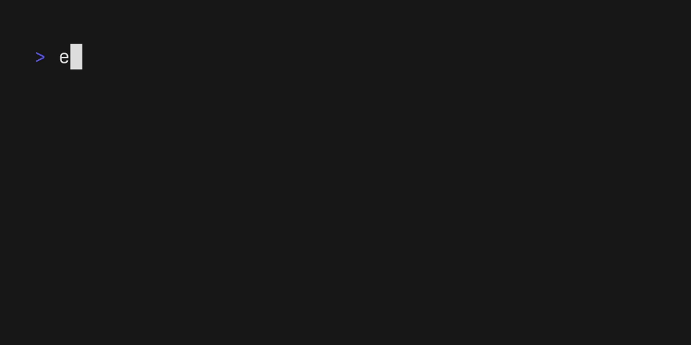

# ego

[](https://github.com/koki-develop/ego/releases/latest)
[](https://github.com/koki-develop/ego/actions/workflows/ci.yml)
[](https://goreportcard.com/report/github.com/koki-develop/ego)
[](./LICENSE)

echo alternative written in Go.



- [Installation](#installation)
- [Usage](#usage)
- [LICENSE](#license)

## Installation

### Homebrew

```console
$ brew install koki-develop/tap/ego
```

### `go install`

```console
$ go install github.com/koki-develop/ego@latest
```

### Releases

Download the binary from the [releases page](https://github.com/koki-develop/ego/releases/latest).

## Usage

```console
$ ego --help
echo alternative written in Go.

Usage:
  ego [flags] [strings]

Flags:
  -n, --no-newline                do not print the trailing newline character
  -e, --enable-escapes            enable interpretation of backslash escapes (default true)
  -E, --disable-escapes           disable interpretation of backslash escapes
      --foreground string         foreground color
      --background string         background color
      --bold                      bold strings
      --faint                     faint strings
      --italic                    italicize strings
      --underline                 underline strings
      --blink                     blink strings
      --rapid-blink               rapid blink strings
      --strikethrough             strikethrough strings
      --separator string          separator between strings (default " ")
      --timestamp                 print timestamp
      --timestamp-format string   timestamp format (default "2006-01-02T15:04:05Z07:00")
  -h, --help                      help for ego
  -v, --version                   version for ego
```

## LICENSE

[MIT](./LICENSE)
